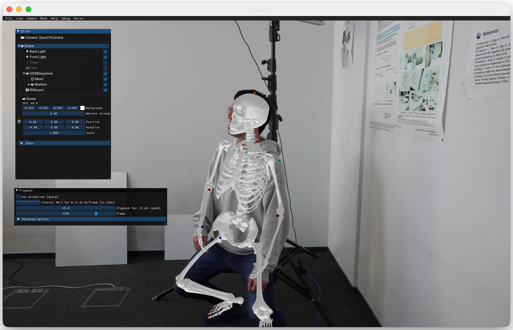

# OpenSim Viewer

A tool for visualizing biomechanical models and motion data from OpenSim with optional synchronized video overlays. It includes a CLI and an integrated Dear ImGui interface with a Pyglet window, with a private OpenSim-focused rendering runtime in this repository. No Qt, `aitviewer` package or sibling checkout is required. See [runtime scope and validation](RUNTIME.md).



## Features

- Load `.osim` + `.mot`, optional `.c3d` markers
- Optional video billboard under calibrated camera (TOML)
- CLI (`osim-viewer`) and GUI (`osim-viewer-gui`)
- Buildable as standalone binaries for Windows/macOS/Linux via PyInstaller
- Docker image for headless X11-based Linux usage

## Install (dev)

```bash
python3.11 -m venv .venv && source .venv/bin/activate
pip install -e .

pip install -r requirements-dev.txt
pre-commit install --install-hooks
```

or with `uv`:

```bash
uv venv .venv --python 3.11
uv pip install --python .venv/bin/python -e . pytest build hatchling
```

## Usage

### CLI

```bash
osim-viewer \
  --osim /path/to/model.osim \
  --mot /path/to/motion.mot \
  --video /path/to/video.mp4 \
  --calib /path/to/calibration.toml \
  --fps 50 \
  --color_parts \
  --joints \
  --smooth
```

Notes:
- `--calib` is optional. If a video is provided without calibration, the video overlay is skipped.
- A fresh session directory is created under the OS cache dir each run and removed on exit.
- Use `--keep-session` to inspect extracted frames and copied files.
- Use `--smooth` to reduce jitter in marker positions.

Run `osim-viewer -h` for all options.

Video input requires `ffmpeg` and `ffprobe` on `PATH`. Video/GIF export requires
`ffmpeg` (H.264 for MP4,
VP9 for WebM). No scikit-video Python package is needed. Transparent video uses
WebM; PNG frame export works without FFmpeg. Encoder failures are shown in the
export dialog and playback/camera state is restored.

## GUI

UI sizing follows the display's logical scale, with high-resolution fonts on
Retina/HiDPI screens. For larger controls, put `ui_scale = 1.25` (or `1.5`) in
`osim-viewer.toml` in the working directory and restart. Default: `1.0`.

```bash
osim-viewer-gui
```

Browse or paste input paths, configure options, and select **Load in viewer**.
The model opens in the same window; **Open / change model** brings setup back.
Motion, markers and calibrated video are optional. FPS 0 means automatic.
Session logs show application messages and loading errors. Model loading runs on
the window thread and may temporarily pause interaction for large recordings.

## Packaging

### PyInstaller (all platforms)

Install build deps, then:

```bash
pyinstaller -y packaging/pyinstaller-cli.spec
pyinstaller -y packaging/pyinstaller-gui.spec
```

Artifacts:
- `dist/osim-viewer` (CLI binary)
- `dist/osim-viewer-gui` (GUI app)

Ensure your `assets/Geometry/` contains the meshes you intend to ship; they are copied to per-user AppData on first run.

### Docker (Linux)

```bash
docker build -t osim-viewer:latest .
xhost +local:root
docker run --rm -it \
  -e DISPLAY=$DISPLAY -v /tmp/.X11-unix:/tmp/.X11-unix \
  -v $PWD:/data osim-viewer:latest \
  --osim /data/model.osim --mot /data/motion.mot
```

## Calibration

The TOML calibration must have a section named after the video filename stem, with fields:

```toml
[my_video]
matrix = [[fx,0,cx],[0,fy,cy],[0,0,1]]
distortions = [k1,k2,p1,p2]   # or with extra terms
rotation = [rx, ry, rz]       # Rodrigues
translation = [tx, ty, tz]
size = [width, height]
```

The app will warn and skip overlay if `--video` is given without `--calib`.

## Python Support

- Python 3.9 (recommended). Other versions are not tested.
- Native dependencies (`nimblephysics` and OpenGL) are still required.
  NimblePhysics depends on PyTorch. The renderer itself uses NumPy/SciPy, not PyTorch.
- OpenCV, VTK/PyVista, Pandas, OmegaConf and Joblib are not runtime dependencies.
  Bundled geometry includes preconverted PLY surfaces; imported VTP surfaces use
  the local reader. See [supported formats and settings](RUNTIME.md).

## Acknowledgements

- [OpenSim](https://opensim.stanford.edu/) for biomechanics modeling
- [aitviewer-skel](https://github.com/MarilynKeller/aitviewer-skel) for 3D visualization

The private rendering subset is derived from AITViewer and its OpenSim extension.
Original copyright notices and the [MIT notice](src/osim_viewer/_rendering/LICENSE)
are retained. It is not a general-purpose AITViewer replacement.

## License

The rendering code is MIT-licensed; see its [license notice](src/osim_viewer/_rendering/LICENSE).
